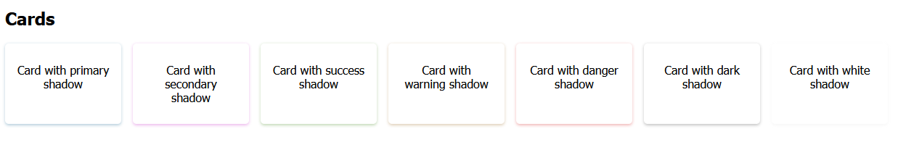

# This is not ready to be used!

## Accessability and customization is the main focus

All components by default with aria props.

## Example

A live showcase of components can be found on https://noby88.github.io/noby-ui-kit/

Below are a few captured examples.




## Setting you own theme

1. Import the Theme context and the default theme

```javascript
import ThemeContext from 'noby-ui-kit/ThemeContext';
import { theme } from 'noby-ui-kit/theme';
```

2. Modify all the you need

```javascript
const myTheme = theme;
myTheme.colors.primary.hue = 10;
```

3. Wrap you content in with the new theme object

```JSX
<ThemeContext.Provider value={myTheme}>
  // your content
</ThemeContext.Provider>
```

## Available components

| Component | Description |
| --------- | ----------- |
| Button    | Button      |
| Spinner   | Spinner     |
| Card      | Card        |
| Page      | Page        |

## Default Theme object

```javascript
{
  transitionsTime: 200,
  colors: {
    primary: {
      hue: 200,
      saturation: 80,
      lightness: 30,
    },
    secondary: {
      hue: 300,
      saturation: 70,
      lightness: 45,
    },
    success: {
      hue: 100,
      saturation: 70,
      lightness: 30,
    },
    warning: {
      hue: 35,
      saturation: 70,
      lightness: 35,
    },
    danger: {
      hue: 360,
      saturation: 80,
      lightness: 45,
    },
    dark: {
      hue: 0,
      saturation: 0,
      lightness: 25,
    },
    light: {
      hue: 0,
      saturation: 0,
      lightness: 90,
    },
  },
  layout: {
    corners: '0.5rem',
    buttons: {
      padding: '0.7rem 1rem',
      boxShadow: '',
      width: '',
      hover: {
        boxShadow: '0 0 0.1rem black',
      },
    },
    card: {
      padding: '0.7rem 1rem',
      border: '',
      size: {
        sm: '10rem',
        md: '20rem',
        lg: '40rem',
        xl: '60rem',
        xxl: '80rem',
        full: '100%',
      },
    },
    page: {
      padding: '1rem',
    },
    surface: {
      base: 'hsl(0 0% 100%)',
      middle: 'hsl(0 0% 98%)',
      top: 'hsl(0 0% 95%)',
    },
  },
}
```
