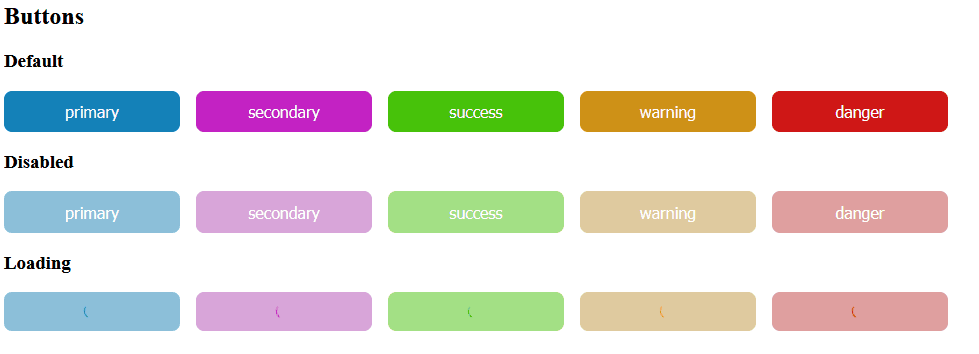
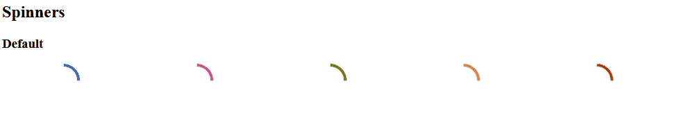

# This is not ready to be used!

## Accessability and customization is the main focus

All components by default with aria props.

## Example

A live showcase of components can be found on https://noby88.github.io/noby-ui-kit/

Below are a few captured examples.





## Setting you own theme

1. Import the Theme context and the default theme

```javascript
import ThemeContext from 'noby-ui-kit/ThemeContext';
import { theme } from 'noby-ui-kit/theme';
```

2. Modify all the you need

```javascript
const myTheme = theme;
myTheme.colors.primary.hue = 10;
```

3. Wrap you content in with the new theme object

```JSX
<ThemeContext.Provider value={myTheme}>
  // your content
</ThemeContext.Provider>
```
